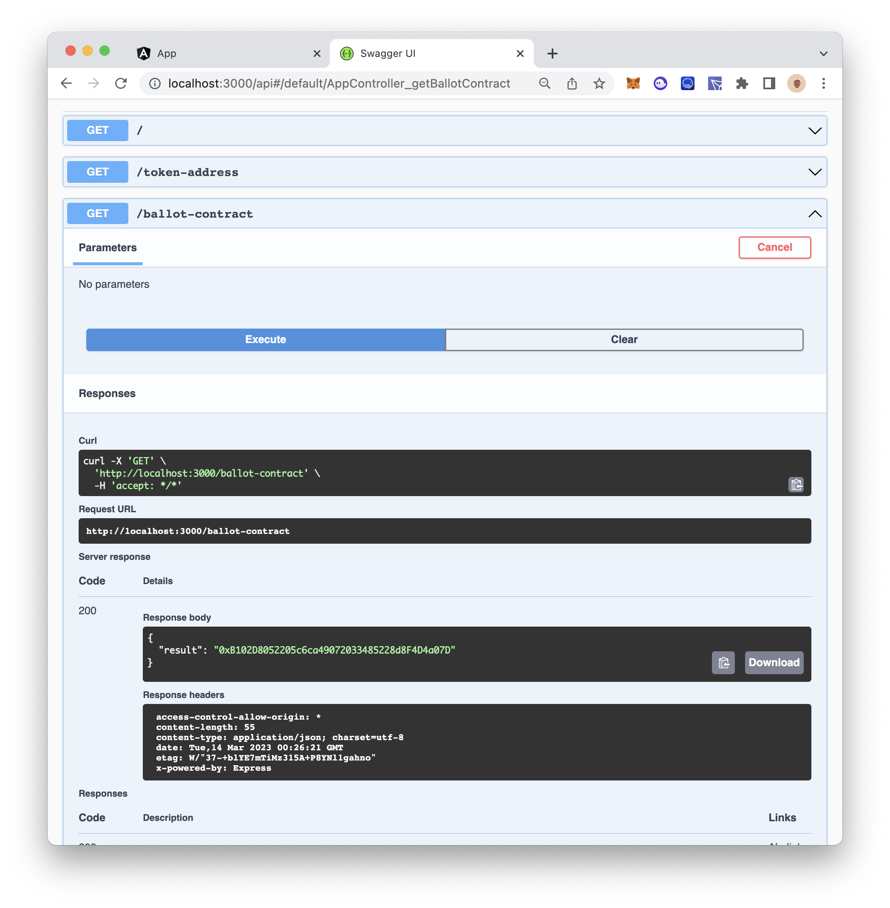

## Installation

```bash
npm install
```

## Set Up

```zsh
cp .env.example .env
```

Fill out all the env variables in `.env`.

```js
PRIVATE_KEY=
ALCHEMY_API_KEY=
MY_TKN_ADDRESS=
BALLOT_ADDRESS=
NETWORK=
```

## Running the app

```bash
# development
npm run start

# watch mode
npm run start:dev

# production mode
npm run start:prod
```

## Test

```bash
# unit tests
npm run test

# e2e tests
npm run test:e2e

# test coverage
npm run test:cov
```

## Support

Nest is an MIT-licensed open source project. It can grow thanks to the sponsors and support by the amazing backers. If you'd like to join them, please [read more here](https://docs.nestjs.com/support).

## Demo



## License

Nest is [MIT licensed](LICENSE).
